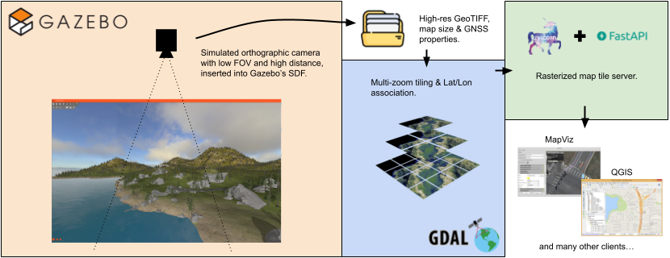

# Gazebo maptiles

Utility to create and serve tilemaps for gazebo simulations



## Documentation

To see an example of the project, check out the [baylands example](./docs/baylands_example/example.md)

If you want an explanation for how the values for the map are calculated, check out [calculations](./docs/calculations/calculations.md)

## Requirements

### External

- 'Gazebo' to take the map photo (https://gazebosim.org/home)
- 'Gdal' to transform the png into a tilemap (https://gdal.org/en/stable/index.html)
- 'Mapviz' to display the tiles (https://swri-robotics.github.io/mapviz/)

### Using uv

You only need to run the package through uv and it will setup a virtual environment and install the dependencies automatically.

```bash
uv run cli -h
```

### Using pip

0) (__Recommended__) Create a virtual environment
```bash
python3 -m venv .venv
source .venv/bin/activate
```
1) Install the project with pip
```bash
pip install -e .
# use the program
python3 -m gazebo_maptiles.cli ...

# If using a virtual environment
deactivate # turns it off
```

## Running

```bash
usage: cli [-h] {photo,create,serve} ...

Script to create and serve tilemaps

positional arguments:
  {photo,create,serve}  Available subcommands
    photo               Take a photo inside a gazebo simulation
    create              Create a new tilemap
    serve               Start a tilemap server

options:
  -h, --help            show this help message and exit
```

### Using uv

```bash
uv run cli [-h] {photo,create,serve} ...
```

### Using pip

```bash
python3 -m gazebo_maptiles.cli [-h] {photo,create,serve} ...
```

## Contributing

To contribute, follow the next steps:

1. Fork the project. (by clicking the 'Fork' button in the repository)
2. Create your feature branch (`git checkout -b feature`)
3. Commit your changes (`git commit -m 'Add some feature'`)
4. Push to the branch (`git push origin feature`)
5. Open a pull request.

## Roadmap

- [x] Create the camera and capture the map photo
- [x] Make a tileset from the map photo
- [x] Serve the tiles with a FastAPI server
- [ ] Position the camera inside gazebo with the specified latitude and longitude.
- [x] Calculate the zoom based on the size of the map
- [ ] Capture multiple photos and make a tileset from them
