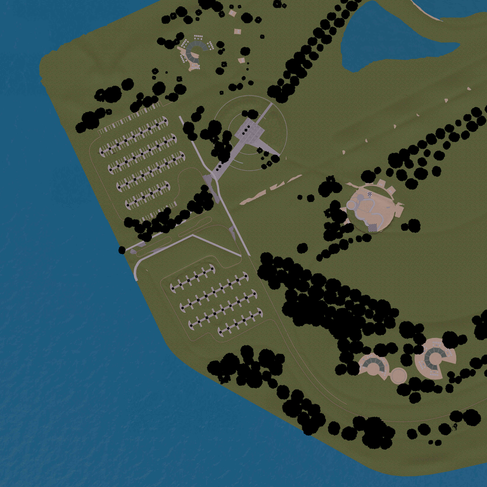
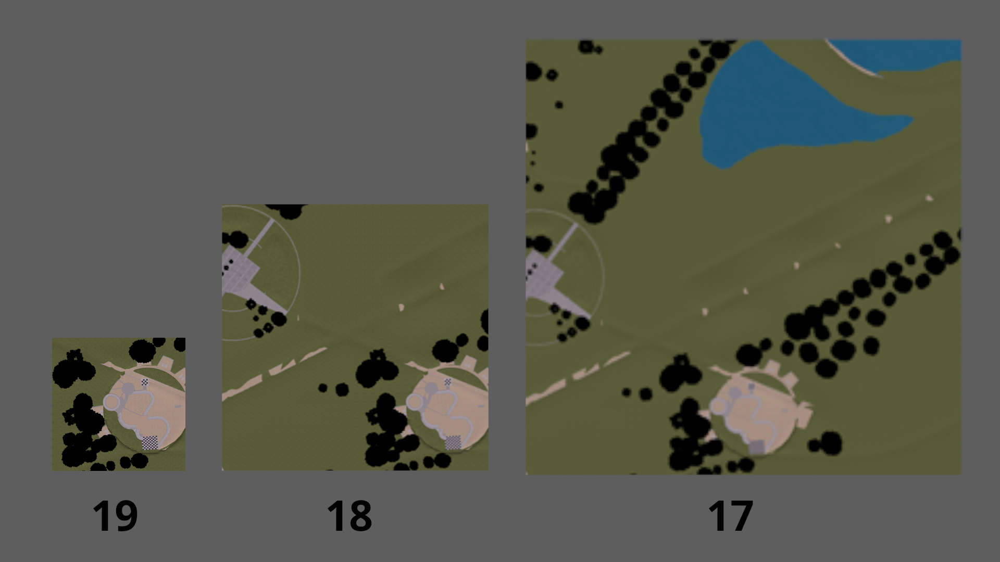
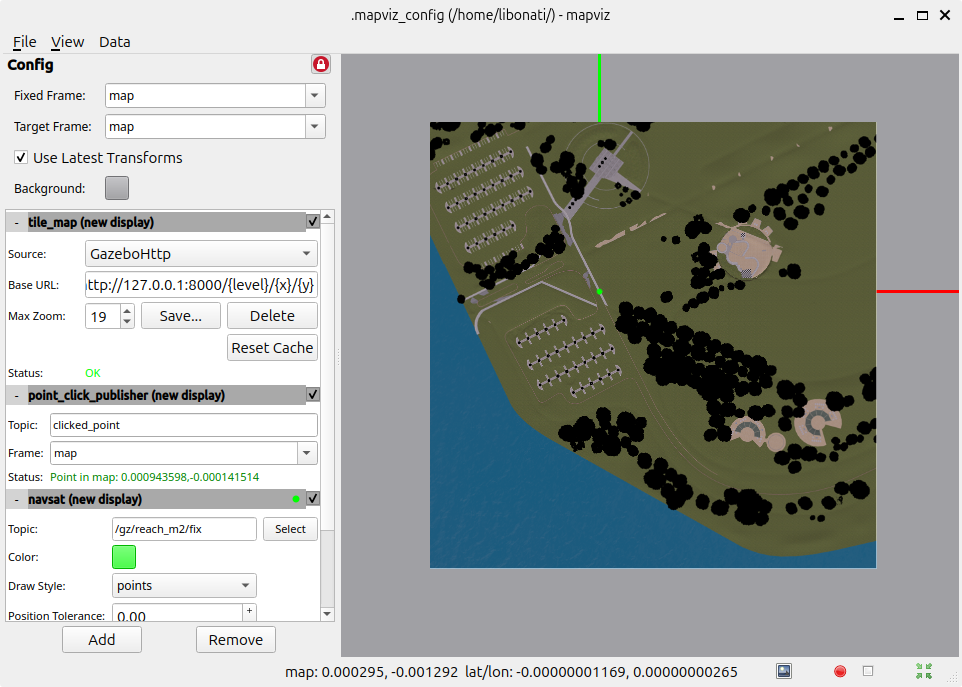

## Baylands Example

We're going to get a map from a gazebo simulation setup by PX4 using worlds from OpenRobotics (https://github.com/PX4/PX4-gazebo-models/blob/main/worlds/baylands.sdf)

then, we get a photo of the map by running

```bash
uv run cli photo --square_side 500 baylands_map.png ./baylands.sdf
# or if you're not using uv:
python3 ./src/gazebo_maptiles/main.py photo --square_side 500 baylands_map.png ./baylands.sdf
```



Once it's done, we get some suggested parameters for the next step: creating the tilemap folder

```bash
# To create a tilemap from this image, run:
uv run cli create --bbox '-0.0022458,-0.0022458,0.0022458,0.0022458' --min_zoom 16 --max_zoom 19 baylands_map.png tiles_dir
# or if you're not using uv:
python3 ./src/gazebo_maptiles/main.py create --bbox '-0.0022458,-0.0022458,0.0022458,0.0022458' --min_zoom 16 --max_zoom 19 baylands_map.png tiles_dir
```

Then, after choosing a directory for the tiles (in this case, we choose 'baylands_tiles') and running the command we get a tilemap for our gazebo simulation.



To make use of it, we run the suggested command:

```bash
# To serve the tiles, run:
uv run cli serve baylands_tiles
# or if you're not using uv:
python3 ./src/gazebo_maptiles/main.py serve baylands_tiles
```

and now we have a functioning WMTS (web map tile service) source to use with mapviz or for other applications.

To use it with mapviz, follow the guide at (https://swri-robotics.github.io/mapviz/guides/local_tile_map_imagery/). You might also need to publish gps information, depending on your mapviz setup. For example:

```bash
ros2 topic pub /gz/reach_m2/fix sensor_msgs/msg/NavSatFix "{
  header: {frame_id: 'base_link'},
  status: {status: 0, service: 1},
  latitude: 0.0,
  longitude: 0.0,
  altitude: 0.0,
  position_covariance_type: 0
}"
```

Set the base URL of the "Custom WMTS Source" to "http://localhost:8000/{level}/{x}/{y}" and max zoom to the one selected (19 in our case) then hit "save". (You might need to zoom in a lot to see it)


