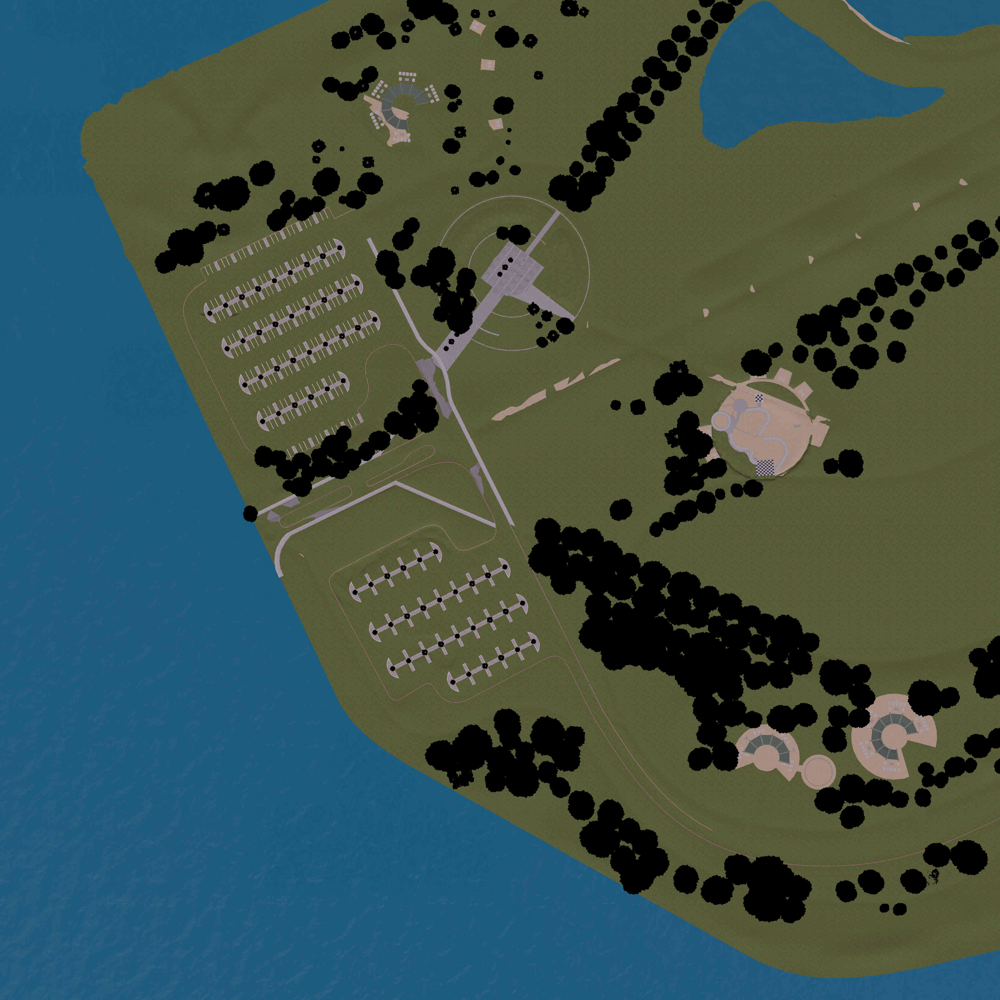
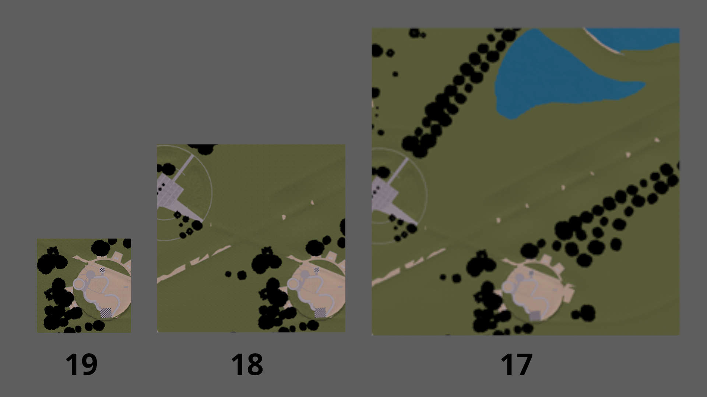
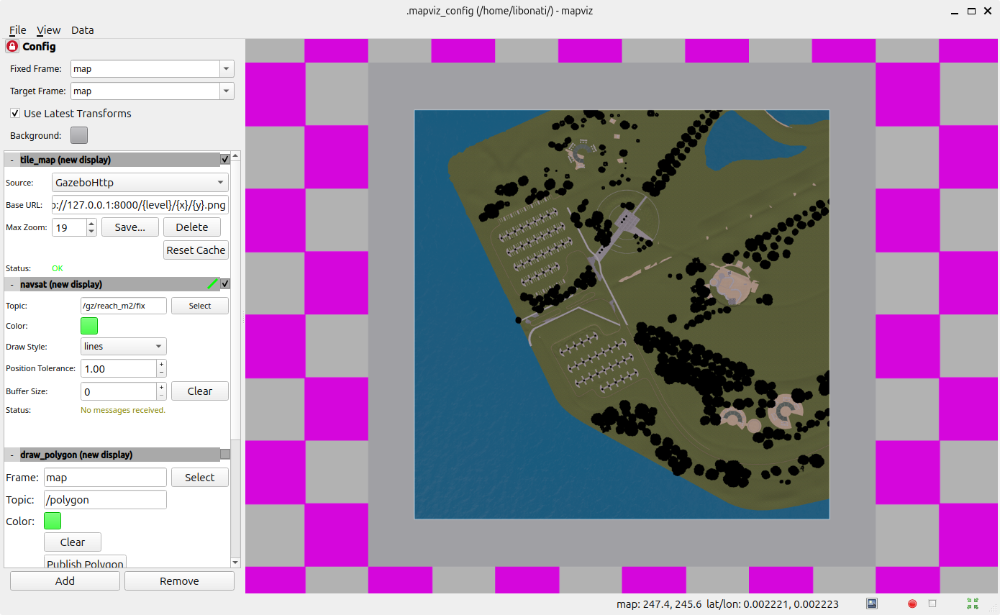

## Baylands Example

We're going to get a map from a gazebo simulation setup by PX4 using worlds from OpenRobotics (https://github.com/PX4/PX4-gazebo-models/blob/main/worlds/baylands.sdf)

then, we get a photo of the map by running

```bash
uv run cli photo --square_side 500 baylands_map.png ./baylands.sdf
# or if you're not using uv:
python3 -m gazebo_maptiles.cli photo --square_side 500 baylands_map.png ./baylands.sdf
```



Once it's done, we get some suggested parameters for the next step: creating the tilemap folder

```bash
# To create a tilemap from this image, run:
uv run cli create --bbox -250.0 -250.0 250.0 250.0 --min_zoom 16 --max_zoom 20 baylands_map.png tiles_dir
# or if you're not using uv:
python3 -m gazebo_maptiles.cli create --bbox -250.0 -250.0 250.0 250.0 --min_zoom 16 --max_zoom 20 baylands_map.png tiles_dir
```

Then, after choosing a directory for the tiles (in this case, we choose 'baylands_tiles') and running the command we get a tilemap for our gazebo simulation.



To make use of it, we run the suggested command:

```bash
# To serve the tiles, run:
uv run cli serve baylands_tiles
# or if you're not using uv:
python3 -m gazebo_maptiles.cli serve baylands_tiles
```

and now we have a functioning WMTS (web map tile service) source to use with mapviz or for other applications.

To use it with mapviz, follow the guide at (https://swri-robotics.github.io/mapviz/guides/local_tile_map_imagery/).

You might also need to publish gps information, depending on your mapviz setup. For example, in the mapviz launch file:

```python
...
        launch_ros.actions.Node(
            package="swri_transform_util",
            executable="initialize_origin.py",
            name="initialize_origin",
            output="screen",
            parameters=[
                {"local_xy_frame": "map"},
                {"local_xy_origin": "auto"},
                # {"local_xy_origin": "zero"},
                {"local_xy_origins": """[
                    {
                        "name": "zero",
                        "latitude": 0.0,
                        "longitude": 0.0,
                        "altitude": 0.0,
                        "heading": 0.0,
                    }
                ]"""}
            ],
...
```

If the local_xy_origin is manual, we add an entry to local_xy_origins (we've added 'zero' to it) and set the local_xy_origin to the name of the entry. If it's auto, we would need to publish an origin with:

```bash
ros2 topic pub /fix sensor_msgs/msg/NavSatFix "{
  header: {frame_id: 'map'},
  status: {status: 0, service: 1},
  latitude: 0.0,
  longitude: 0.0,
  altitude: 0.0,
  position_covariance_type: 0
}"
```

Or publish our simulated robot's position to map.

Then, we set the base URL of the "Custom WMTS Source" to "http://localhost:8000/{level}/{x}/{y}" and max zoom to the one selected (19 in our case) and hit "save".


