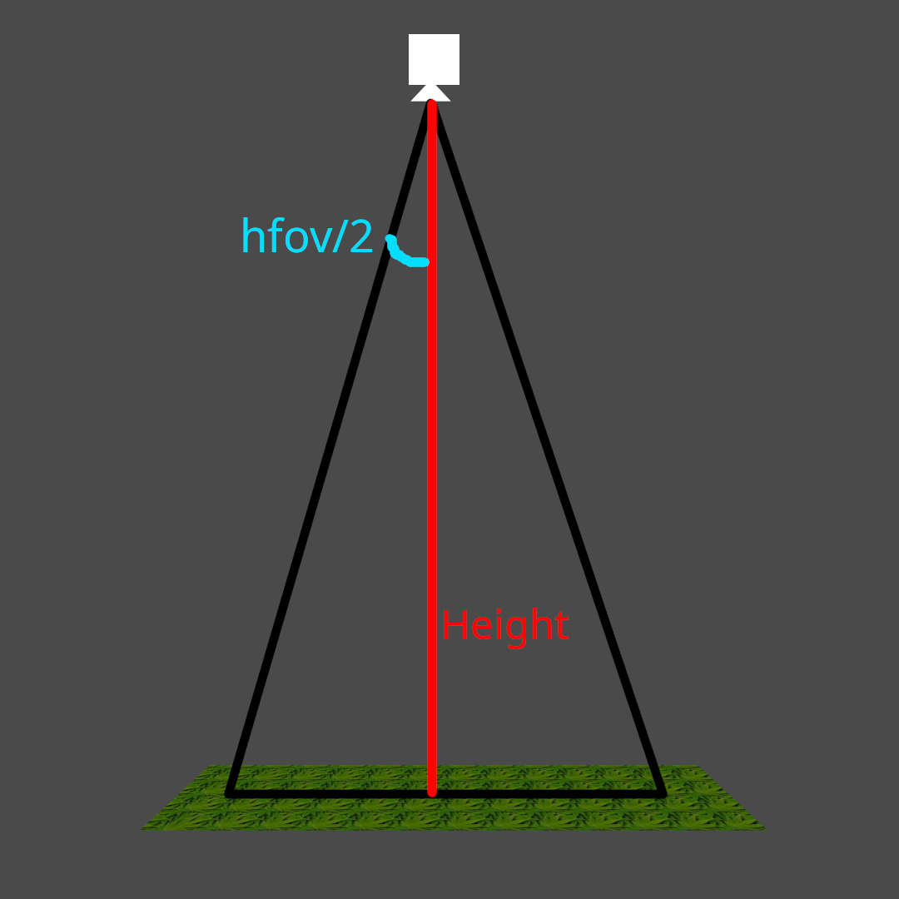

# Calculations

## Bounding box

To get the bounding box size we calculate the kilometers per degree of latitude.

$$\text{Km per degree of latitude} \approx \frac{\pi}{180} * \text{earth radius} * \cos(latitude * \frac{\pi}{180})$$

Then, the length of the image in meters is transformed into degrees and added to the latitude.

$$dcoord = \frac{\text{meter offset}/1000}{\text{Km per degree of latitude(latitude)}}$$
$$\text{new latitude} = \text{latitude} + dcoord$$

The longitude then changes more or less depending on the latitude, because the distance traveled gets smaller when closer to the poles

$$\text{new longitude} = \text{longitude} + \frac{dcoord}{\cos(\text{new latitude} * \pi / 180)}$$

## Distance from center by height

Having the height of the camera, and it's horizontal field of view, we can get the distance from the center of the camera to the edge of it's view with:

$$\tan(\theta) = \frac{\text{opposite}}{\text{adjacent}}$$

Where $\theta = \frac{\text{hfov}}{2}$ and $\text{adjacent} = \text{height}$. Then:

$$\text{distance from center} = \tan(\frac{\text{hfov}}{2}) * \text{height}$$